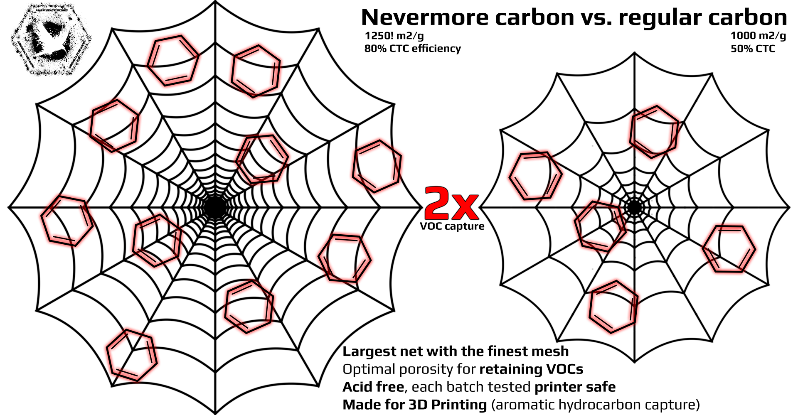
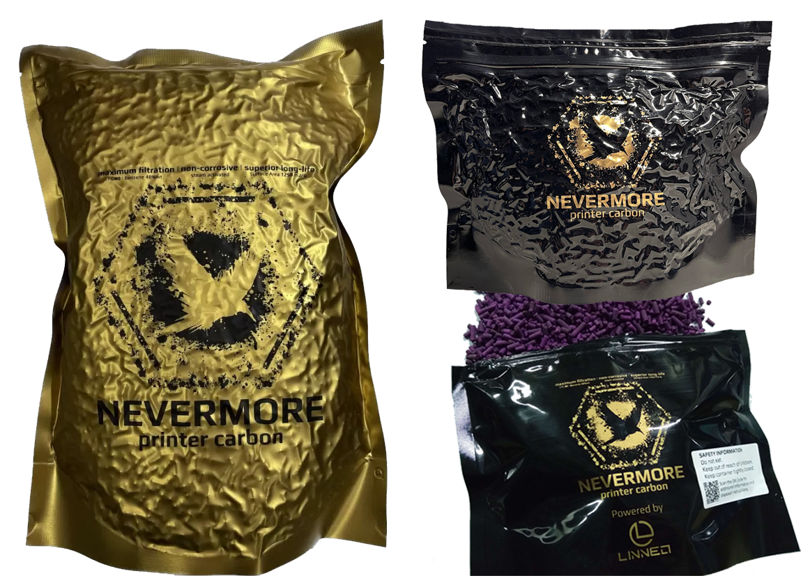

# Reseller
Nevermore carbon began with users getting the _wrong carbon_ type (for retaining printer VOCs), the _3d printer oxidizing/damaging_ carbon type, or the _inactive-charcoal-pellets-branded-as-activated-carbon_ type. Clearly, something needed to be done -so we set out to find the most suitable carbon in the world for the 3d printing use case. We found it - lets spread Nevermore filtration media and filter solutions together!

Nevermore carbon and filtration media is powered by Linneo Components, distributing worldwide from Vigo, Spain. Please enquire on **sales@linneo.tech**

# Nevermore Carbon

* Highly micro-porous and laboratory tested premium activated carbon, from a major european manufacturer
* Market-leading VOC adsorbtion fine tuned for _aromatic hydrocarbons emitted during 3D printing_ such as styrene, benzaldehyde, toluene, benzene, etc. [**CTC >=80**, benzene adsorbtion capacity up to **0.48g/g**]
* Market-leading surface area (storage capacity) of **1250m2/g**! 
* Vacuum packed for minimal dust generation during shipping.
* Vacuum dedusted during the packaging process for immidiate use in 3d printers
* Available in Regular (750ml, 0.33kg) and XL (2300ml, 1kg)

# Nevermore Scorch

* Zeolite-based, highly microporous adsorption medium, enhanced with potassium permanganate (KMnO4).
* Chemically transform printer VOC toxins like styrene – a major VOC in ABS and ASA filaments – into harmless potassium benzoate (food additive).
* The process is not harmed by high chamber temps, but accelerated, making Nevermore Scorch ideal for heated 3D printer chambers!
* Colour changes from bright purple to a dullish gray as its being spent, giving a visual indication of when its time to swap filter media!
* Available in Regular (750ml, 0.66kg) and XL (2300ml, 2kg)

# Nevermore Boost

* Pre-prepared 50/50 mix of Nevermore Carbon and Nevermore Scorch; a less-hassle, best-of-both-worlds printer filtration
* Combining the long-life och stellar adsobtion capacity of activated carbon with Nevermore Scorch performance in hot surroundings.
* Ideal for most users with enclosed 3d printers printing ABS/ASA/PETG/PC in chamber temps of 50C +-10C.

# HEPA

* Nevermore Hepa filters.

# Reseller Overview Table

To find your nearest Nevermore vendor, please look at the table below. If you cannot find a vendor in your country, consider checking nearby countries or international shipping options.

| Region  | Country            |                                             |                                              |                                              |                                              |                                              |
|---------|--------------------|---------------------------------------------|----------------------------------------------|----------------------------------------------|----------------------------------------------|----------------------------------------------|
| EUROPE  | **Germany**        | [Meltbro](https://meltbro.de/)              | [Alchemy3D](https://alchemy3d.de/search?q=nevermore)            | [Replimat](https://www.replimat.eu/)         | [Brink 3D](https://brink-3d.de/)           |              |
|         | **Netherlands**    | [RPM3D](https://rpm3d.nl/)                  |                                              |                                              |                                              |                                              |
|         | **Austria**        | [3DParts](https://www.3dparts.at/)          |                                              |                                              |                                              |                                              |
|         | **Denmark**        | [3DO](https://3do.eu)                       |                                              |                                              |                                              |                                              |
|         | **Norway**         | [Frem3D](https://frem3d.no/collections/nevermore)                                          |                                              |                                              |                                              |                                              |
|         | **Sweden**         | [3DKatten](https://3dkatten.se/)            | [EastBirdBay3D](https://ebb3d.se/?s=nevermore&post_type=product&product_cat=0)              |                                              |                                              |                                              |
|         | **Estonia**        | [Lecktor](https://lecktor.com/en/)          |                                              |                                              |                                              |                                              |
|         | **Italy**          | [DHM-online](https://www.dhm-online.com/en/brand/87-nevermore)                |                                              |                                              |                                              |                                              |
|         | **Spain**          | [HTA3d ](https://www.hta3d.com/en/search?search=nevermore&description=true)                |                                              |                                              |                                              |                                              |
|         | **Portugal**       | [Ratrig](https://ratrig.com/)               | [LAB4450](https://lab4450.com/)              |                                              |                                              |                                              |
|         | **United Kingdom** | [OneTwo3D](https://www.onetwo3d.co.uk)      | [3Dimensionally](https://3dimensionally.com/)|                                              |                                              |                                              |
| AMERICA | **USA**            | [KB3D](https://kb-3d.com)                   | [West3D](https://west3d.com/)                | [Fabreeko](https://www.fabreeko.com)         | [DFH](https://dfh.fm)                        | [Central3DPrinting](https://central3dprinting.com/products/nevermore-activated-carbon-for-voc-standard-xl-scorch)                                             |
| OCEANIA | **Australia**      | [Unique Prints](https://uniqueprints.shop/) | [Phaser FPV](https://www.phaserfpv.com.au/)  | [Dremc](https://store.dremc.com.au/)         |                                              |                                              |
| ASIA/ME | **Israel**         | [Rav Meimad](https://en.ravmeimad.shop/)    |                                              |                                              |                                              |                                              |

## User Guide On Carbon Selection when Nevermore is unavailable

**Picking the Right Carbon for Your 3D Printer**

Choosing the optimal activated carbon for a specific task requires careful
consideration of several key factors, including surface area, CTC/benzene
efficiency, porosity, and pH. These properties play a crucial role in determining the
effectiveness and efficiency of the activated carbon in adsorbing target
contaminants!

**Surface area** is perhaps the most critical factor, as it directly influences the
adsorption capacity of the activated carbon. A higher surface area allows for more
adsorption sites, enabling the activated carbon to capture and retain a greater
amount of contaminants. Activated carbons typically range from 500 to 1250 m²/g,
and a carbon of 1200 m²/g would have twice the capture capacity compared to a
600 m²/g carbon. A good carbon usually has at least 1000 m²/g.
Be sure you're not getting scammed by buying 25% cheaper carbon that lasts half
as long!

**CTC** (Carbon Tetrachloride) **efficiency** - or even better for 3D printing applications,
aromatic hydrocarbon efficiency - is another important consideration, as it
measures the activated carbon's ability to adsorb volatile organic compounds
created from 3D printing. A higher CTC efficiency indicates a greater proportion of
micro-pores, which are essential for capturing - and holding on to - small
contaminants like airstream VOCs. Choosing an activated carbon with a CTC
efficiency that matches the size of the target contaminants ensures optimal
adsorption performance. A good carbon usually has at least 60% CTC.
Be sure you're not getting scammed by buying 25% cheaper carbon that captures
half as much!

**Porosity** , which refers to the distribution of pore sizes within the activated carbon,
also plays a significant role. Activated carbons, depending on quality and carbon
source, will have different ratios of micro-pores (<2 nm), meso-pores (2-50 nm),
and macro-pores (>50 nm). For general use, an even mix might be preferred, as
they can effectively capture a broad spectrum of contaminants while allowing for
efficient mass transfer and regeneration. However, for 3D printing use, a high
micro- and mesoporosity is ideal to both capture VOCs (<2 nm) and VOC-
agglomerates (ultra-fine particles, <50 nm), whereas macropores will struggle to
hold on to VOCs in a hot application like a 3D printer's heated chamber. Good
carbon types for our application are usually sourced from coconut or anthracite, as
they are highly microporous, whereas other common carbons, such as bamboo or
bituminous, usually have a larger percentage of macropores.
Be sure you're not getting scammed by buying 25% cheaper carbon that releases
half the VOCs again!

**The pH of your activated carbon** should be considered, especially when dealing
with pH-sensitive applications or contaminants. Activated carbons with a neutral or

slightly alkaline pH are suitable for most applications, while acidic or basic activated
carbons may be required for specific tasks. In order to capture any VOC type
generated from any filament, a neutral carbon (capable of binding to both neutral,
acidic, and alkaline VOCs) is preferred. Some users have also experienced severe
printer corrosion from using acid-contaminated/treated carbon that, for some
reason, got released with the heating cycles.
Be sure to buy a 3D printer-safe carbon that is steam-activated and not acid-
treated/coated!

**Compare carbons in a jiffy**

As a general comparison number for neutral carbons, try multiplying surface area
and CTC efficiency (available space * capturing efficiency):

**Carbon A** : 1250 m²/g * 80% CTC would be 1250 * 0.8 = 1000 ( _yes, this is
Nevermore specs_ )

**Carbon B** : 1000 m²/g * 50% CTC would be 1000 * 0.5 = 500

This means that Carbon A can be expected to be 2x the performance, capturing
more VOCs for longer.

Be sure to buy Carbon A unless it's twice the price (or if you wish to refill your
cartridges twice as often - it gets tedious quickly!).

